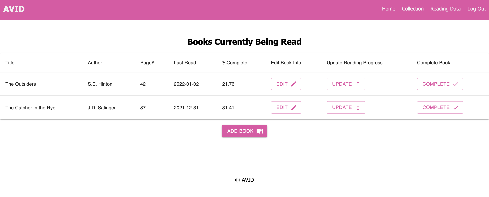
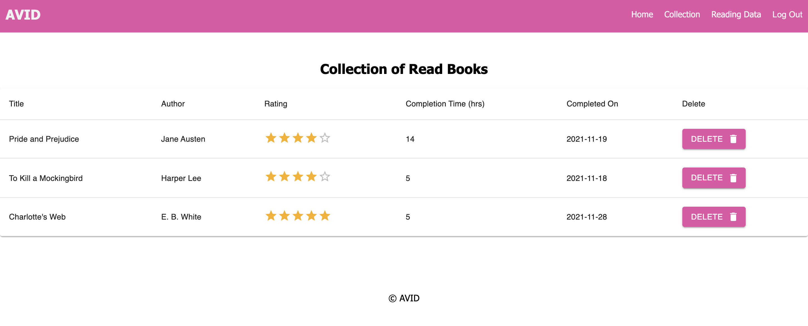
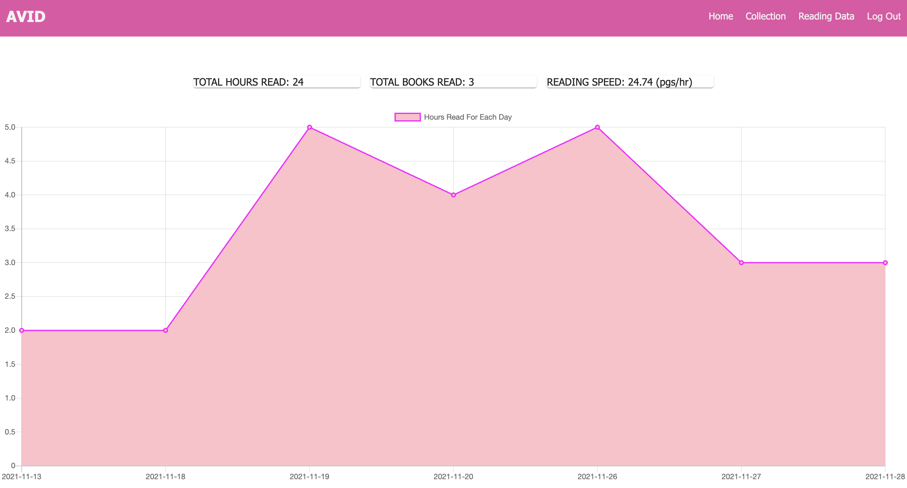

# AVID - Reading Tracking App

## Table of Contents

- [Description](#description)
- [Screenshots](#screenshots)
- [Built With](#built-with)
- [Getting Started](#getting-started)
  - [Prerequisites](#prerequisites)
  - [Installation](#installation)
- [Acknowledgements](#acknowledgements)
- [Contacts](#contacts)

## Description

AVID is an app designed to track the user’s personal reading and reading behavior. Users begin by adding the title, author, and page count of the book they would like to track (this information can be edited after with the ‘Edit’ button). The user is then able to edit the book’s information, update the reading progress of the book, or mark the book as complete. Clicking ‘Update’ will allow the user to update their progress in the book, and prompt them to input the date the user last read the book, how long they read for, and the current page they’re on. The updated progress is then tracked and displayed on screen.  Users can marks books as complete, giving them a rating and adding them to the 'Collections' page. AVID also features a Reading Data page that features stats and metrics, such as the user’s reading speed and how long they read for each day via chart.js

## Screenshots

## Built With

## Getting Started

This app uses PostgreSQL for database storage. There is a database.sql file in the repository containing the database structure needed to run this app.

### Prerequisites

This app requires Node.js, Express.js, and PostgreSQL to be ran successfully..

### Installation

Fork and clone repo
Initialize the database with the code from database.sql
In the terminal: npm install
npm run server
npm run client to automatically launch the app in a browser

## Acknowledgements

Thanks to my instructors and peers at Prime Digital Academy, making this app would not have been possible without their teaching and support!

## Contacts

  